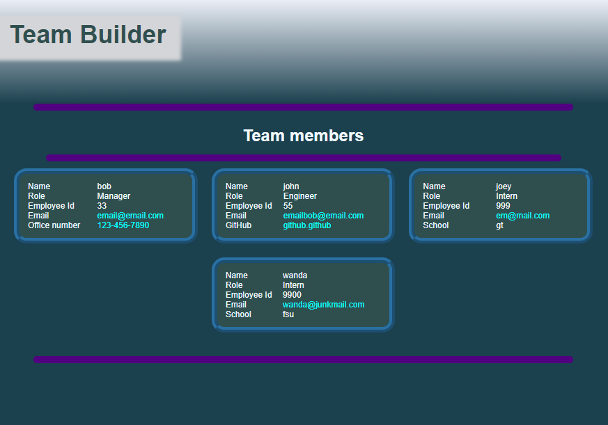

# TeamPageGen
This is a command-line app to build an HTML page for a software team's profile.  It runs under node.js to produce an index.html file.
It takes in information from the user about employees on a software engineering team, then generates the index.html webpage that displays summaries for each person. Testing is also provided by means of Jest functions.  This helps make the code maintainable. There is a unit test for each of the classes.

## Link to the walkthrough video
Here is a link to a walkthrough video that demonstrates the functionality and all of the tests passing.

## User Story

```md
AS A manager
I WANT to generate a webpage that displays my team's basic info
SO THAT I have quick access to their emails and GitHub profiles
```

## Features

```
* When the user is prompted for the team members' names and other information, an HTML file is generated that displays a formatted team roster based on user input.
* The user is prompted to enter the team manager’s name, employee ID, email address, and office number
* One of the fields is for the employee's email address.  When it is clicked, the user's default email program opens and populates the TO field of the email with the employee's email address.
* When the end user clicks on a manager's office number, the default phone client opens with the manager's phone number field populated.
* Next, the user is presented with a menu with the option to add an engineer or an intern or to finish building the team
* For the engineer option, the user is prompted to enter the engineer’s name, ID, email, and GitHub username
* After each entry, the user is prompted to choose to enter another employee, or to finish.
* When the user selects the intern option, the user is prompted to enter the intern’s name, ID, email, and school.
* When the user exits the application, the HTML is generated as a file named index.html
* When the end user (as a client user accessing the html file) clicks on an engineer's GitHub username, then that GitHub profile opens in a new tab.
* When the end user clicks on an email address, the default email client opens with the employee's email field populated.
```

## Screenshot

The following image shows a screenshot of the generated HTML page:



## Video of walkthrough


## Backup of walkthrough video


